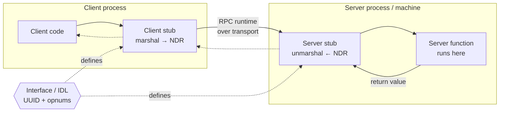
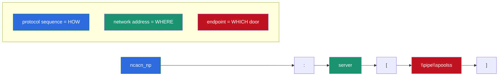
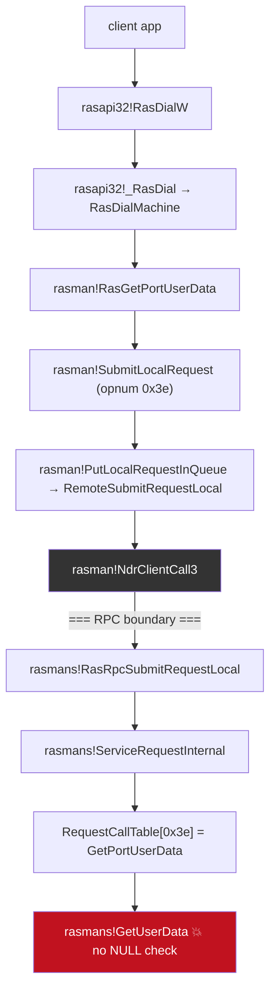
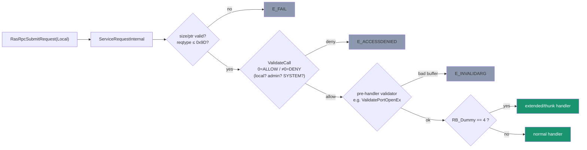
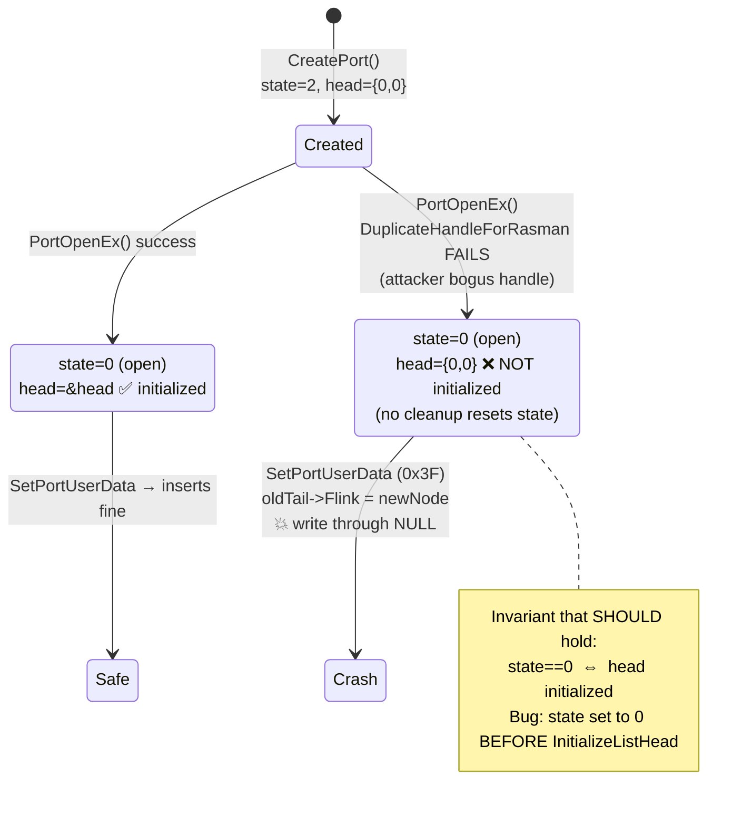
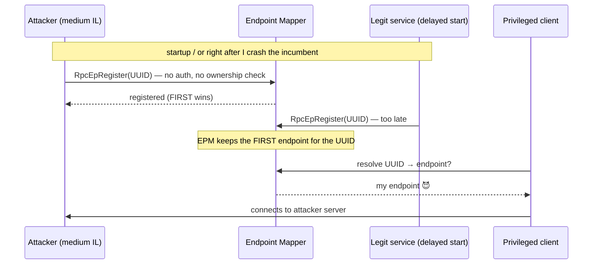
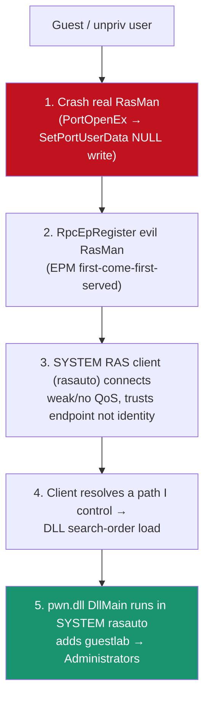
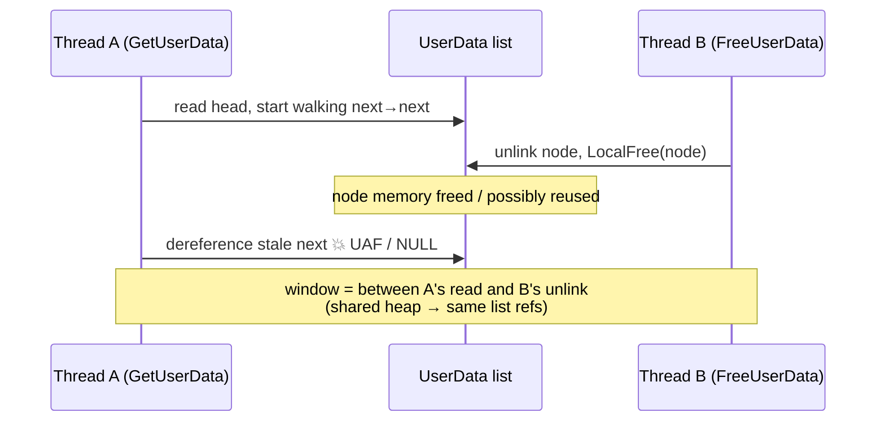

# Summercon Talk — "Racing the Machine: N-Day RPC Exploitation on Windows (a RasMan Story)"

**Length:** ~50 min (aim ~38–42 content slides, ~1 min each, leave ~5 min Q&A)
**Thesis:** A guided tour of writing N-day RPC LPE exploits, told through one real chain against RasMan — including the dead ends — so the audience leaves able to hunt their own.

Title alternatives (pick your vibe):
- "You Snooze, You Own: Hijacking Windows RPC Servers"
- "How I Learned to Stop Worrying and Impersonate the Client (and why that didn't work)"
- "RasMan and the Terrible, Horrible, No Good, Very Bad Endpoint"

---

## ACT 0 — Cold Open / Hook (2–3 min)

### Slide 1 — Title
- Title + name + Trail of Bits. One-line subtitle: "Everything I tried, what worked, what humiliated me."
- 🎤 Humor beat: "This talk has a happy ending. It took ~40 dead ends to get there. You're getting the speedrun."

### Slide 2 — The one-sentence exploit
- "Unprivileged user → SYSTEM, by convincing a SYSTEM process to talk to *my* RPC server instead of the real one."
- **DIAGRAM idea (hero image):** 3-panel comic — (1) legit SYSTEM client → real RasMan; (2) I crash the real one; (3) SYSTEM client now → my evil RasMan. Reuse this exact art at the end to show the full chain.

### Slide 3 — Why RPC / why you should care
- RPC is *everywhere* on Windows and is a giant, under-audited LPE surface.
- N-day angle: you don't need an 0-day; patch diffing + "the client never checks anything" gets you far.
- Set expectations: "You'll leave with a repeatable methodology + a cheat-sheet chart."

---

## ACT 1 — RPC Crash Course (7–8 min) — *the teaching foundation*

> Keep this tight and visual; it's the price of admission for the rest. Cite sud0ru's series as the deep-dive homework.

### Slide 4 — What RPC actually is
- "Call a function that lives in another process (or machine) as if it were local."
- Client stub ↔ server stub, NDR marshalling, RPC runtime.
- **DIAGRAM:** 3 boxes — Client | Interface (IDL) | Server — with a function arrow crossing the process boundary. (Your notes' "high level diagram with 3 boxes.")
- Ref: sud0ru Part 1.

### Slide 5 — The vocabulary you can't skip
- **Interface** (IDL → MIDL → `_c.c` / `_s.c` / `.h`), **UUID**, **opnum**.
- **Protocol sequence**: `ncalrpc` (local ALPC), `ncacn_np` (named pipe), `ncacn_ip_tcp` (TCP).
- **String binding**: `<protseq>:<addr>[<endpoint>]` — e.g. `ncacn_np:server[\pipe\spoolss]`.
- **DIAGRAM:** anatomy-of-a-string-binding, colored callouts on each field.
- 🎤 Humor: "It's a phone number for functions. And like phone numbers, anyone can spoof the caller ID." (foreshadow)

### Slide 6 — Endpoint Mapper & well-known vs dynamic endpoints
- Dynamic: server asks OS for a port, registers with EPM (`RpcEpRegister`); client queries EPM by UUID.
- Well-known: hardcoded; **do not have to tell EPM** — remember this, it matters later.
- **KEY SEED:** "EPM is first-come-first-served. There's no ownership check." (This is the whole CVE-2025-49760 insight — plant it now, pay it off in Act 3.)
- Ref: sud0ru Part 1; SafeBreach RPCRacer.

### Slide 7 — Binding handles
- Opaque `void*` = the "connection." Auto / implicit / explicit.
- **DIAGRAM / analogy:** the tin-can-phone — the binding handle is the string between the cans (credit csandker). Security attributes attach to the string.

### Slide 8 — Security: the part everyone gets wrong
- Server registers an **authentication service**; client picks an **authentication level (0–6)**.
- **The trap:** server registering auth ≠ enforcing it. By default "security is optional" — a client can send `RPC_C_AUTHN_LEVEL_NONE` and still get in unless the server adds `RPC_IF_ALLOW_SECURE_ONLY` / a security callback / a DACL.
- **QoS / impersonation level** is chosen *by the client*; default with no QoS = **SecurityImpersonation** (server can impersonate you!).
- **DIAGRAM:** a "security checklist" the server *should* do vs. what it *actually* does (mostly unchecked boxes).
- Ref: sud0ru Parts 4–6; csandker RPC post.

### Slide 9 — Tools of the trade (recon)
- **RpcView** — see every registered interface/endpoint per process. *(Screenshot: RasMan interface.)*
- **NtObjectManager** (Forshaw) — `Get-RpcServer`, `Get-RpcEndpoint`; generate clients from a DLL.
- **impacket-rpcdump** — dump EPM remotely, unauthenticated.
- **Akamai RPC toolkit** — the `rpc_interfaces.json` scraper (how you confirmed RasMan's 16 methods).
- 🎤 Humor: "RpcView is the Zillow of attack surface — you're just browsing other people's poorly secured property."

---

## ACT 2 — The Hunt: Finding & Crashing RasMan (9–10 min)

### Slide 10 — Why RasMan
- Remote Access Connection Manager (`rasmans.dll` server ← `rasman.dll` client via `rasapi32`), runs as SYSTEM, VPN/dial-up plumbing, huge legacy surface.
- Reachable by unprivileged users; VPN = potentially interesting blast radius (open Q: remote trigger?).
- **DIAGRAM:** the call chain you mapped —
  `RasDialW → _RasDial → RasDialMachine → rasman!RasGetPortUserData → SubmitLocalRequest(0x3e) → NdrClientCall3 → [RPC] → rasmans!RasRpcSubmitRequestLocal → ServiceRequestInternal → RequestCallTable[0x3e] → GetUserData`
- 🎤 Humor: "RasMan has 16 RPC methods and the emotional stability of a linked list. We'll get to that."

### Slide 11 — Methodology: how to find the reachable functions
- Enumerate the interface (Akamai json + your BinaryNinja script that dumped `RequestCallTable` entries: handler + validation fn).
- The dispatch model: `RasRpcSubmitRequest` / `...Local` → `ServiceRequestInternal` → per-reqtype **access gate (`ValidateCall`)** + **pre-handler validator** + **handler**.
- **DIAGRAM:** the dispatch pipeline (reqtype → ValidateCall → ValidatePortOpenEx → handler), with the "0=ALLOW / nonzero=DENY" gate. Show `ValidateCall`'s local-caller / `FRasmanAccessCheck` logic.
- Takeaway box: "Find the opnums an unprivileged/remote user is allowed to call — that's your reachable surface."

### Slide 12 — Reversing environment / techniques (the toolbox slide people screenshot)
- **BinaryNinja + Binja MCP** (you drove reversing with Claude over the MCP — call this out honestly, incl. "verify everything the LLM claims").
- **IDA** for struct-recovery experiments (`pdbcopy full.pdb stripped.pdb -p` to study how structs decompile).
- **WinDbg scripting**: IEFO/`svchost` split-out trick to debug a service from launch; conditional breakpoints; `.for` loops to walk the PCB array; your `pcb.wds` dump script.
- **winbindex** to pull exact vulnerable/patched `rasmans.dll` builds; function-similarity diffing.
- **DIAGRAM:** a "lab bench" graphic — one box per tool with what it gave you.

### Slide 13 — The WinDbg service-debugging trick (mini how-to)
- Copy `svchost.exe`→`rasdbg.exe`, give RasMan its own SvcHost group, IEFO-attach WinDbg, bump `ServicesPipeTimeout`.
- **DIAGRAM:** before/after of RasMan's hosting (shared netsvcs svchost → dedicated debuggable process).
- 🎤 Humor: "Step 1 of exploiting a service is convincing Windows to let you watch it be born. It's weirdly wholesome."
- (Put the exact commands in backup/appendix slides.)

### Slide 14 — Crash #1: the `GetUserData` NULL-deref
- Circular doubly-linked `UserData` list; `GetUserData` walks it with **no NULL check** on head/next.
- You found it... and then found it was *already* CVE-2026-21525 (DoS), credited to 0patch (cryptika writeup).
- 🎤 Humor: "I found a 0-day. Then I found the guy who found it first. Then I found his blog post. Then I found humility."
- Teaching point: **binary-diffing reality** — same build numbers across Jan/Feb, feature-flag-gated code (`Feature_..._IsEnabledDeviceUsageNoInline`), `GetUserData` looked *unpatched* even in fixed builds. How to not fool yourself.

### Slide 15 — Crash #2: the `PortOpenEx` ordering bug (the one you use)
- PCB (Port Control Block) holds the `UserData` list head @ `0x438`; state field @ `0x18`.
- **Invariant that should hold:** `state==0 (open)` ⇔ list head initialized (flink=blink=&head).
- **The bug:** `PortOpenEx` sets `state=0` *before* `InitializeListHead`; if the code between fails, cleanup never resets `state`. Result: `state==0` + head = `{0,0}`.
- **Trigger:** make `DuplicateHandleForRasman` fail with an attacker-controlled bogus handle → skip init.
- **Payoff:** then `SetPortUserData` (reqtype `0x3F`) does `oldTail->Flink = newNode` → **NULL-pointer write** → crash.
- **DIAGRAM (the money slide):** state machine — CreatePort(state=2, head={0,0}) → PortOpenEx happy path (state=0, head=&head) vs. sabotaged path (state=0, head={0,0}) → SetPortUserData writes through NULL.
- Takeaway: "Logic bugs = broken invariants. Find the two facts that are *supposed* to travel together, then break them apart."

### Slide 16 — Building the client that triggers it
- Couldn't call `RasRpcGetVersion` (extra auth checks) → used `RasRpcSubmitRequest` instead.
- Built the client from an IDL recovered via RpcView / MS-RRASM Appendix A / NtObjectManager.
- The `RequestBuffer` layout (`RB_PCBIndex`, `RB_Reqtype`, `RB_Dummy==4` picks extended handler table, payload).
- Validated the crash on the vulnerable build; confirmed patched build survives.

---

## ACT 3 — Becoming the Server: Endpoint Hijacking (6–7 min)

### Slide 17 — The pivot: crashing is boring, *replacing* is fun
- Callback to Slide 6: EPM is first-come-first-served, no ownership check (**CVE-2025-49760 / RPCRacer**).
- Some services register late (delayed start); some endpoints can be grabbed after you crash the incumbent.
- **DIAGRAM:** timeline race — legit service registration window vs. your registration; whoever's first wins the UUID.
- Ref: SafeBreach "You Snooze, You Lose."

### Slide 18 — RPC-Racer methodology (generalize it)
- RPC-Recon: scan EPM at logon (before delayed services), diff early vs. late to find grabbable interfaces.
- `RpcEpRegister` an interface matching a legit service; clients querying by UUID get routed to *you*.
- Combine with your crash: don't wait for a race window — **make one** by killing the incumbent.
- 🎤 Humor: "SafeBreach raced Windows at startup. I cheated and shot the other runner." (i.e., crash-then-register is your contribution vs. pure race.)

### Slide 19 — Who connects to my evil RasMan, and why
- The real `rasman.dll` (SYSTEM) and other privileged clients connect to your server — **because they set no/weak QoS and don't validate the server's identity.**
- **This is the crux:** clients trust the endpoint, not the server. Default QoS lets *you* impersonate *them*; but also *they* execute your responses.
- **DIAGRAM:** "who dials in" — list captured clients with their integrity levels (SYSTEM / NETWORK SERVICE / PPL), like the StorSvc example in the SafeBreach post.

### Slide 20 — Proof it works
- You verified: vulnerable-version client connects to `EvilRasmansRPCServer` under your user *and* Guest; patched version refuses (Microsoft's fix = client now enforces Security QoS, requires server = `NT AUTHORITY\SYSTEM`).
- Confirmed patched client *does* connect when you run the evil server as SYSTEM (via `PsExec -i -s`) — proving the fix is exactly a QoS/identity check.
- Takeaway: "The patch tells you the bug. Here the patch = 'the client finally checks who it's talking to.'"

---

## ACT 4 — Now What? The Privilege-Escalation Odyssey (8–9 min) — *the "what didn't work" heart of the talk*

> This is the section other hackers will love. Be honest, be funny, teach the *why*.

### Slide 21 — Plan A: "I'll just impersonate the SYSTEM client!"
- The naive dream: SYSTEM client connects, I call `RpcImpersonateClient`, steal the token, become SYSTEM.
- **DIAGRAM:** the fantasy flow (client token → my thread → CreateProcessWithTokenW → 😎).
- 🎤 Humor: "This is where I spent a weekend feeling like a genius."

### Slide 22 — Why Plan A face-plants: the Windows auth model
- Impersonation gives your *thread* the client's **token**, but a **network logon token** ≠ an interactive SYSTEM token: reduced privileges, and impersonation alone doesn't grant SYSTEM's group memberships/capabilities.
- To *act* as SYSTEM via token theft you generally need **SeImpersonatePrivilege** and a *usable* token — the classic "Potato" preconditions.
- Open thread from your notes: root-cause still fuzzy (SeImpersonate was on?) → **action item: Forshaw "Social Engineering the Windows Kernel" + Windows Security Internals ch. on token impersonation.**
- **DIAGRAM:** token anatomy — network vs. interactive token; what impersonation actually copies vs. what it doesn't.
- Refs: csandker Named Pipes (impersonation levels); Forshaw.

### Slide 23 — Impersonation levels, precisely
- SecurityAnonymous / Identification / Impersonation / Delegation — and the `SECURITY_SQOS_PRESENT` + IL client flags that *disable* impersonation.
- On *remote* pipes, the achievable level depends on the **server's** privileges (SeImpersonate → Impersonation; SeEnableDelegation → Delegation; none → Identification).
- Takeaway: "Whether you can impersonate is decided by a negotiation you don't fully control."

### Slide 24 — Plan B: NTLM relay
- Idea: capture the client's NTLM auth to my evil server, relay it (ESC8/ADCS, etc.) — exactly RPC-Racer's Stage 2 endgame.
- NTLM is relayable because it can't mutually authenticate; unsigned NTLM over RPC is the dream (compass-security "Relaying NTLM over RPC", PetitPotam, WinReg relay).
- **DIAGRAM:** recreate the HTB NTLM relay diagram but with **your evil RPC server as the adversary-in-the-middle** (per your note).

### Slide 25 — Why Plan B faceplanted (for me)
- RasMan's client uses **GSS_NEGOTIATE** → negotiates **Kerberos**, not NTLM; and/or signing/EPA in the way.
- Tried to force an NTLM downgrade — didn't pan out reliably for this client.
- Teaching point: **relay needs (a) NTLM chosen, (b) no signing/EPA, (c) a useful relay target.** Miss any one and you're stuck.
- 🎤 Humor: "Kerberos showed up to the fight I'd trained for NTLM. Rude."
- Refs: your NTLM-Relay notes; vaadata NTLM-relay limits; HTB module (Kerberos-can't-be-used list).

### Slide 26 — The meta-lesson of Act 4
- "Every 'boundary' you read about (QoS, impersonation, NTLM) has fine print. The exploit lives in the fine print, and so do the dead ends."
- Transition: "So if I can't *be* the client and can't *relay* the client... I'll just get the client's process to run my code."

---

## ACT 5 — What Actually Worked: DLL Hijack into `rasauto` (5–6 min)

### Slide 27 — The winning idea
- Instead of stealing identity, get the **SYSTEM-side RAS process (`rasauto`) to load my DLL** — code exec directly in SYSTEM context.
- This is the `github.com/0xasritha/test` "Guest Path" chain: fake RasMan host (`exploit_host2.cpp`) + payload DLL (`pwn.c`) loaded into SYSTEM `rasauto` → adds `guestlab` to Administrators.
- **DIAGRAM:** final chain — Guest user → crash real RasMan → register evil RasMan → SYSTEM `rasauto` connects → DLL search-order load → `DllMain` runs as SYSTEM.

### Slide 28 — Prerequisites (be upfront)
- Built-in Guest as console user; `guestlab` account; Guest in RDP users; no active admin GUI session; shared autodial/ICS/VPN infra preconfigured.
- DLL redirection enabled machine-wide (you got it working via MS "DLL redirection for unpackaged apps"; `SafeDllSearchMode` considerations).
- 🎤 Humor: "Yes, it needs prerequisites. So does every potato. We're all standing on a mountain of preconditions pretending it's flat ground."

### Slide 29 — Is this a "Potato"?
- Open question from your notes — briefly compare to Rotten/Juicy/LocalPotato lineage (foxglove, LocalPotato CVE-2023-21746). Where does crash-hijack-then-DLL-load sit?
- Good place to invite the room's opinion.

### Slide 30 — Demo (or recorded demo)
- Live or video: Guest → run chain → `whoami` in DLL = SYSTEM / user added to Administrators (`group_add.txt`, `system.txt`).
- Backup screenshots in appendix in case demo gods are angry.

---

## ACT 6 — The Memory-Corruption Rabbit Holes (3–4 min) — *optional depth, cut if short on time*

### Slide 31 — Beyond DoS: could the NULL bugs be more?
- The race-condition angle: `GetUserData` reads a stale `next` while `FreeUserData` unlinks/`LocalFree`s → potential UAF, not just NULL-deref.
- Your experiments: same-list proof (Set/Get/Free operate on one list), `LocalAlloc(LMEM_ZEROINIT)` reuse theory, two-thread heap-sharing race hypothesis, the tiny timing window.
- Honest status: didn't weaponize beyond crash — but it's a roadmap.
- **DIAGRAM:** the race window timeline (Thread A in GetUserData traversal vs. Thread B FreeUserData unlink).

### Slide 32 — Patch-diffing findings worth sharing
- `int_VpnProfileAutoConnect` got a **debounce** (`IsAutoConnectInDebounceWindow`, 1-min cooldown) — why add a cooldown? (smells like a re-entrancy/race fix).
- Feature-flag gating means "the code is there but off" — how you reasoned about default states, and your Binja reachability script (`VpnProfileAutoConnect → GetUserData`? you concluded no path, ~70% confident — verify before publishing).
- Takeaway: "A debounce in a security patch is a confession."

---

## ACT 7 — Takeaways + The Grand Chart (5 min)

### Slide 33 — Methodology, distilled (the "how to hunt" slide)
1. **Enumerate** reachable interfaces/opnums (RpcView, NtObjectManager, rpcdump, Akamai json).
2. **Find a crash or a race** to unseat a well-known server (memory/logic bug, or delayed-start window).
3. **Register your own** server (EPM first-come-first-served).
4. **Find the privilege mismatch** — the client that trusts you (bad QoS / no server check / attacker-controlled data / DLL path).
5. **Cash out** — impersonation *(if you have the privileges)*, relay *(if NTLM + unsigned)*, or code-exec via what the client does with your data (DLL load, trusted path).

### Slide 34 — THE END-SLIDE CHART (your improved decision tree)
See "Appendix: Master Chart" below — build this as the closing visual. It maps *conditions/mitigations* → *available attack*.

### Slide 35 — What I'd tell past-me / call to action
- "Read the patch, not the CVE title." "The client is the weak link, not the protocol." "Write the dumb PoC first."
- Blog post + PoCs link (`github.com/0xasritha/test`).

### Slide 36 — Thanks + Q&A
- Credits: sud0ru, csandker, SafeBreach, Akamai, Forshaw/NtObjectManager, 0patch, Trent/ToB.

### Appendix slides (backup)
- Exact WinDbg IEFO setup + `pcb.wds`; `RequestBuffer`/`ValidateCall` pseudocode; build numbers (vuln vs patched); full references.

---

## APPENDIX: Master Chart (design spec for the closing slide)

**Root:** "I can reach / can register an RPC server." Two big branches: **(A) I am the server** and **(B) I am the client.** Leaf color = mitigation state that enables it.

```
                         ┌─────────────────────────────────────────────┐
                         │  Reached an RPC interface (RpcView/rpcdump)   │
                         └───────────────┬───────────────────────────────┘
                                         │
              ┌──────────────────────────┴───────────────────────────┐
        (A) BE THE SERVER                                       (B) BE THE CLIENT
        (hijack the endpoint)                                   (call the server)
              │                                                       │
   Precondition: crash incumbent (mem/logic bug)          ┌───────────┼───────────────┐
   OR delayed-start race + EPM 1st-come-1st-served        │           │               │
   [CVE-2025-49760 RPCRacer]                               │           │               │
              │                                    Server registers  Server calls   Reachable
   Who connects to me? depends on CLIENT mitISg3:  auth but doesn't  RpcImpersonate  handler has
              │                                    ENFORCE it        Client() but    a memory-
   ┌──────────┼───────────────┬──────────────┐    (accepts AUTHN_   ignores return  corruption /
   │          │               │              │     LEVEL_NONE)       → force fail →   logic bug
 Client     Client uses    Client authn's  Client passes  │          runs as server  │
 sets bad/  SECURITY_      w/ NTLM &        attacker-      │          (LPE)           ▼
 no QoS →   IDENTIFICATION unsigned →       controlled     ▼                          DoS / UAF /
 SecurityIm (or SQOS set)  RELAY it         data / trusted Call privileged            RCE / LPE
 personation → can only    [ESC8, ADCS,     path →         funcs unauth'd            (RasMan
 default     identify,     PetitPotam,      logic bug /    (info leak, priv          GetUserData,
   │         NOT impersonate WinReg relay]  DLL hijack     action)                   SetPortUserData)
   ▼            │               │           into SYSTEM        │
 Impersonate    ▼           Needs: NTLM     proc (rasauto) │
 the client  dead end for   chosen + no     ← THIS WORKED   │
   │         priv-esc       signing/EPA +   for RasMan      │
   ▼                        relay target    (Guest→SYSTEM)  │
 Have SeImpersonate +       │
 usable token? ─── yes ──► token theft → SYSTEM  (Potato family)
   │
   no / network-logon token only ──► impersonation ≠ SYSTEM  (my Plan A dead end)
```

**Legend / mitigation toggles to annotate on the chart:**
- `RPC_IF_ALLOW_SECURE_ONLY` set? → kills unauth calls (branch B-left).
- Client sets `SECURITY_SQOS_PRESENT` + IL ≤ Identification? → kills impersonation (branch A-left).
- Client enforces server identity / Security QoS (RasMan's *patch*)? → kills endpoint hijack payoff.
- NTLM signing / EPA on, or Kerberos negotiated? → kills relay (my Plan B dead end).
- SeImpersonatePrivilege held + interactive-grade token? → enables token-theft-to-SYSTEM.
- Null/UAF guarded, bounds checked? → kills the mem-corruption leaf.

**RasMan path highlighted in red on the final build:** BE THE SERVER → client sets bad QoS *and* passes trusted DLL path → DLL hijack into SYSTEM `rasauto`. (Impersonation and relay branches shown greyed-out with a ❌ = "I tried these first.")

---

## Reference list (for the Thanks/Appendix slide)

- sud0ru — Windows IPC Deep Dive, Parts 1–11 (RPC fundamentals, security, endpoints, access matrix): https://sud0ru.ghost.io/
- csandker — Offensive Windows IPC #1 Named Pipes (impersonation levels): https://csandker.io/2021/01/10/Offensive-Windows-IPC-1-NamedPipes.html
- csandker — Offensive Windows IPC #2 RPC (access matrix, QoS/impersonation, attack formulas): https://csandker.io/2021/02/21/Offensive-Windows-IPC-2-RPC.html
- SafeBreach — "You Snooze, You Lose" / RPC-Racer, CVE-2025-49760: https://www.safebreach.com/blog/you-snooze-you-lose-winning-rpc-endpoints/
- Akamai RPC toolkit (interface scraper, rpc_interfaces.json): https://github.com/akamai/akamai-security-research/tree/main/rpc_toolkit
- James Forshaw — NtObjectManager; "Calling Local Windows RPC Servers" (Project Zero); "Social Engineering the Windows Kernel" (talk).
- Compass Security — Relaying NTLM over RPC: https://blog.compass-security.com/2020/05/relaying-ntlm-authentication-over-rpc/
- PetitPotam: https://github.com/topotam/PetitPotam ; Akamai WinReg relay: https://www.akamai.com/blog/security-research/winreg-relay-vulnerability
- foxglove — Rotten Potato; LocalPotato CVE-2023-21746 writeup: https://medium.com/@farhadanwari/exploiting-lpe-on-windows-server-via-localpotato-cve-2023-21746-project-report-9de6573e96dd
- vaadata — Understanding NTLM & NTLM relay limits: https://www.vaadata.com/blog/understanding-ntlm-authentication-and-ntlm-relay-attacks/
- HTB Academy — NTLM module (relay diagram, Kerberos-unavailable cases): https://academy.hackthebox.com/module/232/section/2504
- TrustedSec — Abusing Windows built-in VPN providers (Always-On VPN / autodial): https://trustedsec.com/blog/abusing-windows-built-in-vpn-providers
- cryptika — RasMan DoS 0-day (the GetUserData bug, ≈ CVE-2026-21525): https://www.cryptika.com/windows-remote-access-connection-manager-0-day-vulnerability-let-attackers-trigger-dos-attack/
- Securelist — MS RPC security mechanism step by step: https://securelist.com/ms-rpc-security-mechanism-step-by-step/116036/
- cicada-8 — Impacket Developer Guide, RPC parts 1 & 2.
- MS-RRASM (RasMan RPC protocol + Appendix A IDL): https://learn.microsoft.com/en-us/openspecs/windows_protocols/ms-rrasm/
- Your PoC: https://github.com/0xasritha/test

---

# SPEAKER NOTES / SCRIPT (high-stakes slides)

> Delivery style: conversational, ~130 wpm. `[BEAT]` = pause. `[CLICK]` = advance build/animation. Bracketed italics are stage directions, not spoken. Times are targets, not scripture.

## Slide 14 — Crash #1: `GetUserData` NULL-deref  (~75 sec)

"So I start reversing RasMan's linked-list code, and I find `GetUserData`. It walks a circular doubly-linked list of per-port user data. And it walks it with — [BEAT] — no NULL check. On the head, on the next pointer, nothing. If that list is ever in a weird state, this thing dereferences null and the whole SYSTEM service face-plants. [CLICK]

I was *thrilled*. I thought I had an 0-day. [BEAT] Then I did the responsible thing and searched to make sure. And I found it was already reported as a denial-of-service CVE. Credited to 0patch. With a blog post. [BEAT] So in the span of about ten minutes I found a 0-day, found the person who found it first, and found humility. [let the laugh land]

But — and this is the actual lesson — getting scooped taught me the most important skill in N-day work: *diffing without fooling yourself.* [CLICK] Because when I pulled the 'patched' build from winbindex, `GetUserData` still looked vulnerable. The null-deref was right there. Some builds shared version numbers across months. Half the interesting code was behind feature flags — present in the binary, switched off. [BEAT] If you trust the CVE title and the version string, you will waste weeks. You have to read the actual bytes."

*Delivery: land the "0-day / found the guy / found humility" as a rule of three — beat before "humility." Don't rush it; this is your rapport moment with the room.*

## Slide 15 — Crash #2: the `PortOpenEx` ordering bug  (~110 sec, THE money slide)

"Okay, so the null-deref was taken. But it pointed me at something better. [CLICK]

Every RAS port has a control block — a PCB. Big struct. Two fields matter: a **state** field, and the **head** of that user-data list. [CLICK — highlight the two fields] There's an invariant the whole codebase assumes: if `state` equals zero — 'open' — then the list head has been *initialized*, meaning it points at itself, the way a proper empty circular list does. State-is-open and head-is-initialized are supposed to *always travel together.* [BEAT]

Here's the bug. [CLICK — reveal the two code paths side by side] `PortOpenEx` sets `state = 0` *first*, and initializes the list head *later*. And in between those two steps there's a pile of code that can fail. One of those steps is `DuplicateHandleForRasman` — which operates on a handle value *I* control. [CLICK] So I hand it a bogus handle. It fails. The function bails out early — [BEAT] — but there's no cleanup to walk the state back to 'not open.' [CLICK]

So now I've got a port that says 'I'm open and ready' — `state = 0` — with a list head that's still all zeros. The invariant is broken. [CLICK] Then I send a `SetPortUserData` — request type 0x3F. It trusts the state, grabs the tail, and does `oldTail->Flink = newNode`. It just wrote a heap pointer [BEAT] through a null. SYSTEM service down. [CLICK]

And that's the whole trick to logic bugs: find two facts that are *supposed* to be true at the same time, and find the one code path that lets you make one true without the other."

*Delivery: this slide is a build. Do NOT show the whole state machine at once. Reveal: fields → invariant → the reordering → my sabotage → the crashing write. The final sentence is the takeaway — slow down, it's quotable.*

## Slide 21 — Plan A: "I'll just impersonate the SYSTEM client!"  (~45 sec)

"So now I'm the server. A process running as SYSTEM connects to me. [CLICK] And the first idea — the *obvious* idea — is: RPC lets a server impersonate its client. There's literally a function called `RpcImpersonateClient`. So I call it, I grab the SYSTEM token off my thread, I duplicate it, I spawn a shell with `CreateProcessWithTokenW`, and I'm SYSTEM. [BEAT] Right? [CLICK — 😎 emoji] This is where I spent a weekend feeling like a genius."

*Delivery: play it straight and confident here — you're setting up the fall. The "😎" and the beat sell it.*

## Slide 22 — Why Plan A face-plants  (~110 sec)

"It did not work. [BEAT] And understanding *why* is worth more than the exploit. [CLICK]

When you impersonate a client, you get their **token** on your thread. But a token is not a costume you put on to become that person. [CLICK] The token that shows up when a client connects to you over the network is a **network logon token** — it's stripped down. Reduced privileges, and critically it doesn't carry the group memberships and capabilities that SYSTEM's real, interactive token has. [BEAT] Impersonating SYSTEM over the wire does not make you SYSTEM. It makes you a hollow copy of SYSTEM with most of the good parts missing. [CLICK]

To actually *turn* a stolen token into code execution as that identity, you generally need **SeImpersonatePrivilege** and a token that's usable for the thing you want to do. That's the precondition the entire 'Potato' family of exploits is built on. [CLICK] And honestly? [BEAT] I'm still not 100% sure why mine failed the way it did — I thought I had SeImpersonate on. So my homework, and maybe yours: James Forshaw's talk 'Social Engineering the Windows Kernel,' and the token chapter in Windows Security Internals. [BEAT] I'd rather tell you 'I don't fully know yet' than sell you a clean story that's wrong."

*Delivery: the "costume" metaphor is the anchor — say it slowly. The honesty beat at the end ("I don't fully know yet") builds huge credibility with a Summercon crowd. Own it, don't apologize for it.*

## Slide 23 — Impersonation levels, precisely  (~50 sec)

"Quick precision, because this bites everyone. [CLICK] There are four impersonation levels: Anonymous, Identification, Impersonation, Delegation. The *client* gets to cap this — if the client sets `SECURITY_SQOS_PRESENT` with Identification or lower, you as the server can see *who* they are but you cannot *act* as them. [CLICK] And on remote pipes it's wilder: the level you get depends on *your server's* privileges — SeImpersonate gets you Impersonation, SeEnableDelegation gets you Delegation, nothing gets you Identification. [BEAT] The point: whether you *can* impersonate is a negotiation, and you don't hold all the cards."

## Slide 24 — Plan B: NTLM relay  (~55 sec)

"Fine. If I can't *be* the client, I'll steal their authentication and *relay* it. [CLICK] This is RPC-Racer's endgame — the client tries to authenticate to me, I catch that NTLM handshake and forward it somewhere useful: ADCS web enrollment, ESC8, the classic. [CLICK] And NTLM is beautiful for this because it can't mutually authenticate — the client has no way to verify it's talking to the *real* server. That's the whole PetitPotam, WinReg-relay, coerce-and-relay family. [CLICK — show the HTB-style diagram with MY evil RPC server in the middle] So I set up to be the man in the middle."

## Slide 25 — Why Plan B face-plants  (~65 sec)

"And RasMan's client said: [BEAT] no. [CLICK] It authenticates with GSS_NEGOTIATE — which negotiates, and it negotiated **Kerberos**, not NTLM. Kerberos doesn't relay like NTLM does. [CLICK] I tried to force a downgrade to NTLM — couldn't make it stick for this client. [BEAT] Kerberos showed up to the fight I'd trained for NTLM. Rude. [let laugh land, CLICK]

The general lesson — write this down if you're relay-hunting: [CLICK] a relay needs *three* things true at once. NTLM has to be the chosen protocol. Signing and channel-binding — EPA — have to be off. And you need a relay target that gets you something. Miss any one, and you're where I was: back at the drawing board. [BEAT] Which is exactly where the *real* exploit came from."

*Delivery: "no." with a hard stop is the joke's setup; "Rude." is the punchline. Two separate beats. Then pivot crisply to the rule-of-three, which is the genuinely useful takeaway.*

## Slide 34 — The Master Chart  (~150 sec, closing)

"So here's everything, on one slide. [CLICK — root only] You've reached an RPC interface. From here the tree splits two ways. [CLICK] You can *be the server* — hijack the endpoint. Or you can *be the client* — and attack the server you're calling. [BEAT]

Down the server side [CLICK — left branch], your entry ticket is either a startup race or a crash — that's the RasMan chain. And then *which* attack you get is decided entirely by what the client failed to check. [CLICK — leaves light up one at a time] Bad QoS? You can impersonate them — *if* you have the privileges, which, remember, I didn't. Unsigned NTLM? Relay — *if* it's actually NTLM, which, remember, it wasn't. [BEAT] Attacker-controlled path or data? [CLICK — this leaf turns red] Get their SYSTEM process to load your DLL. That's the one that worked.

Down the client side [CLICK — right branch], it's the server's sins: registers auth but never enforces it, so you call privileged functions unauthenticated. Calls `RpcImpersonateClient` but ignores the return value, so you force it to fail and it runs *as itself*. Or there's just a memory-corruption bug in a handler you can reach. [BEAT]

Here's what I want you to take home. [CLICK — the mitigation toggles fade in on each edge] Every single edge on this tree has a *toggle* — one setting, one flag, one check — that turns it off. `ALLOW_SECURE_ONLY`. Client QoS. NTLM signing. SeImpersonate. A null check. [BEAT] The exploit is never really the bug. The exploit is the *toggle someone left in the wrong position.* [CLICK — RasMan path highlighted end to end, impersonation & relay branches greyed with ❌] Go find your toggle. Thank you."

*Delivery: this is your close — rehearse it until you don't need the screen. The chart should animate along with your words (build per [CLICK]), never appear all at once. End on "Go find your toggle" — that's the line people repeat in the hallway.*

---

# DIAGRAM SOURCES (Mermaid + Graphviz)

> Paste Mermaid into mermaid.live, Obsidian, or a ```mermaid fenced block. Paste Graphviz into any `dot` renderer (VS Code Graphviz preview, `dot -Tpng`, or edotor.net). Colors/animation are your job in the slide tool — these give you correct structure and labels.

## D4 — Slide 4: RPC high-level (3 boxes)  [Mermaid]



## D5 — Slide 5: string-binding anatomy  [Mermaid]



## D10 — Slide 10: RasMan call chain  [Mermaid]



## D11 — Slide 11: dispatch pipeline  [Mermaid]



## D15 — Slide 15: PortOpenEx invariant break  [Mermaid state]



## D17 — Slide 17: EPM registration race  [Mermaid sequence]



## D27 — Slide 27: full winning chain  [Mermaid]



## D31 — Slide 31: the UAF race window  [Mermaid sequence]



## D22 — Slide 22: token anatomy (why impersonation ≠ SYSTEM)  [Graphviz]


## D34 — Slide 34: MASTER CHART (closing decision tree)  [Graphviz]

> Render this, then in your slide tool: (a) reveal per-branch to match the script, (b) color the RasMan path red, (c) grey out the impersonation + relay leaves with a ❌. The `xlabel`s are the mitigation toggles — put them on the edges.

```dot
digraph rpc_master {
  rankdir=TB; fontname="Helvetica";
  node [shape=box, style="rounded,filled", fontname="Helvetica", fillcolor="#eaeaea"];
  edge [fontname="Helvetica", fontsize=10];

  root [label="Reached an RPC interface\n(RpcView / rpcdump / NtObjectManager)", fillcolor="#2d6cdf", fontcolor=white];

  // ---- Branch A: be the server ----
  A [label="A) BE THE SERVER\n(hijack the endpoint)", fillcolor="#ffd166"];
  A_entry [label="Entry ticket:\ncrash incumbent (logic/mem bug)\nOR delayed-start race\n[EPM first-come-first-served / CVE-2025-49760]"];
  root -> A;
  A -> A_entry;

  a_qos   [label="Client sets bad/no QoS\n→ SecurityImpersonation default\n→ impersonate client"];
  a_relay [label="Client authn's w/ NTLM, unsigned\n→ RELAY (ESC8/ADCS, PetitPotam,\nWinReg relay)"];
  a_path  [label="Client trusts attacker-controlled\npath/data (not identity)\n→ DLL hijack into SYSTEM proc", fillcolor="#1a936f", fontcolor=white];
  A_entry -> a_qos   [xlabel="toggle: client QoS /\nSECURITY_SQOS_PRESENT"];
  A_entry -> a_relay [xlabel="toggle: NTLM signing / EPA /\nKerberos negotiated"];
  A_entry -> a_path  [xlabel="toggle: server-identity check\n(RasMan's patch)"];

  a_qos_yes [label="have SeImpersonate + usable token?\nYES → token theft → SYSTEM (Potato)"];
  a_qos_no  [label="network-logon token only\nNO → impersonation ≠ SYSTEM\n(my Plan A dead end ❌)", fillcolor="#e0e0e0"];
  a_qos -> a_qos_yes;
  a_qos -> a_qos_no;

  a_relay_note [label="needs NTLM + no signing + relay target\n(RasMan used Kerberos → my Plan B dead end ❌)", fillcolor="#e0e0e0"];
  a_relay -> a_relay_note;

  a_path_win [label="pwn.dll runs as SYSTEM in rasauto\nGuest → SYSTEM  ✅ THIS WORKED", fillcolor="#1a936f", fontcolor=white];
  a_path -> a_path_win;

  // ---- Branch B: be the client ----
  B [label="B) BE THE CLIENT\n(call the server)", fillcolor="#ffd166"];
  root -> B;
  b_auth [label="Server registers auth but\ndoesn't ENFORCE it\n→ call privileged funcs unauth'd\n(info leak / priv action)"];
  b_imp  [label="Server calls RpcImpersonateClient\nbut ignores return\n→ force failure → runs as server (LPE)"];
  b_mem  [label="Reachable handler has\nmemory-corruption / logic bug\n→ DoS / UAF / RCE / LPE\n(GetUserData, SetPortUserData)"];
  B -> b_auth [xlabel="toggle: RPC_IF_ALLOW_SECURE_ONLY"];
  B -> b_imp  [xlabel="toggle: check impersonation\nreturn value"];
  B -> b_mem  [xlabel="toggle: null/bounds checks"];
}
```



